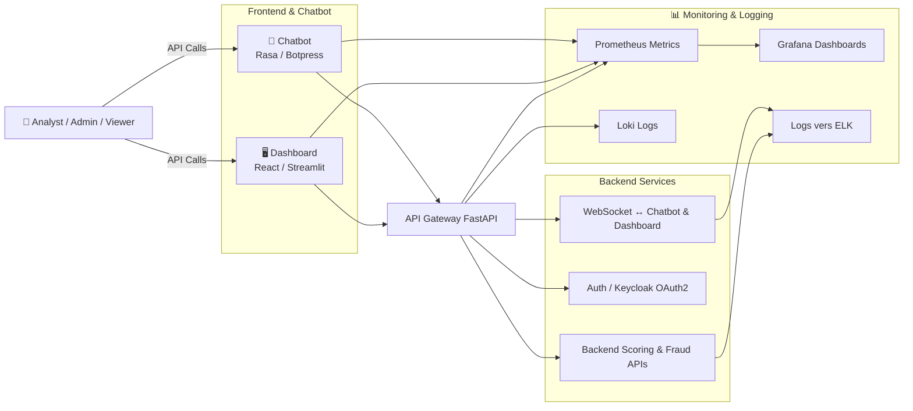

# Interface Utilisateur — Dashboard + Chatbot

## 🧩 Description

Ce module fournit une **interface utilisateur complète** pour la plateforme de scoring/fraude.  
Il regroupe :

1. **Dashboard interactif** (User Story 5.1)
   - Visualisation des scores, alertes et KPIs (fraude, AUC, latence)
   - Export PDF/Excel
2. **Chatbot conversationnel** (User Story 5.2)
   - Interaction via Rasa ou Botpress
   - Intents : demander score, alerte, rapport
   - Multilingue (FR/EN)
3. **Intégration Dashboard + Chatbot** (User Story 5.3)
   - Chatbot accessible depuis le dashboard
   - Synchronisation des filtres et du contexte
   - Communication en temps réel via WebSocket
4. **Monitoring**
   - Metrics et logs centralisés avec Prometheus, Grafana et Loki

---

## 🏗️ Architecture

