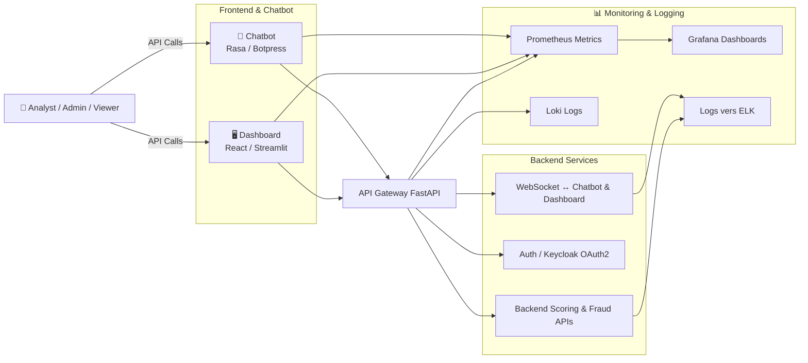

# Interface Utilisateur — Dashboard + Chatbot

## 🧩 Description

Ce module fournit une **interface utilisateur complète** pour la plateforme de scoring/fraude.  
Il regroupe :

1. **Dashboard interactif** (User Story 5.1)
   - Visualisation des scores, alertes et KPIs (fraude, AUC, latence)
   - Export PDF/Excel
2. **Chatbot conversationnel** (User Story 5.2)
   - Interaction via Rasa ou Botpress
   - Intents : demander score, alerte, rapport
   - Multilingue (FR/EN)
3. **Intégration Dashboard + Chatbot** (User Story 5.3)
   - Chatbot accessible depuis le dashboard
   - Synchronisation des filtres et du contexte
   - Communication en temps réel via WebSocket
4. **Monitoring**
   - Metrics et logs centralisés avec Prometheus, Grafana et Loki

---

## 🏗️ Architecture


---
## 📁 Arborescence complète — Interface Utilisateur (Dashboard + Chatbot)
```bash
interface_utilisateur/
│
├── dashboard_app/                          # 🧭 Application de visualisation (User Story 5.1)
│   ├── src/
│   │   ├── components/
│   │   │   ├── Header.jsx                  # Barre supérieure avec logo, navigation, langue
│   │   │   ├── Sidebar.jsx                 # Menu latéral (accès aux sections : Scores, Alertes, KPIs)
│   │   │   ├── KPI_Cards.jsx               # Composants affichant taux de fraude, AUC, latence
│   │   │   ├── AlertsTable.jsx             # Tableau listant les alertes détectées
│   │   │   ├── ScoreTrendsChart.jsx        # Graphique d’évolution des scores dans le temps
│   │   │   ├── ExportButtons.jsx           # Boutons d’export PDF/Excel
│   │   │   ├── ChatbotWidget.jsx           # Intégration du chatbot (iframe / composant latéral)
│   │   │   └── Loader.jsx                  # Indicateur de chargement (spinners)
│   │   │
│   │   ├── pages/
│   │   │   ├── DashboardPage.jsx           # Page principale du tableau de bord
│   │   │   ├── AlertsPage.jsx              # Page dédiée aux alertes et filtrage
│   │   │   └── ReportsPage.jsx             # Page export et rapports
│   │   │
│   │   ├── services/
│   │   │   ├── apiClient.js                # Appels aux APIs scoring/fraude via Axios
│   │   │   ├── authService.js              # Gestion JWT / OAuth2 via Keycloak
│   │   │   └── exportService.js            # Fonctions d’export PDF et Excel
│   │   │
│   │   ├── utils/
│   │   │   ├── formatters.js               # Formatage des données (pourcentage, temps, etc.)
│   │   │   └── constants.js                # Variables globales : URLs, couleurs, seuils
│   │   │
│   │   ├── styles/
│   │   │   ├── dashboard.css               # Styles globaux de l’interface
│   │   │   └── theme.js                    # Définition du thème clair/sombre
│   │   │
│   │   ├── App.jsx                         # Point d’entrée React principal
│   │   └── index.js                        # Initialisation de l’app React
│   │
│   ├── public/
│   │   ├── index.html                      # Template HTML principal
│   │   └── assets/                         # Logos, icônes, images
│   │
│   ├── package.json                        # Dépendances front (React, Chart.js, Axios, Keycloak)
│   └── Dockerfile                          # Image Docker de l’application dashboard
│
│
├── chatbot_app/                            # 🤖 Application Chatbot (User Story 5.2)
│   ├── rasa_project/
│   │   ├── data/
│   │   │   ├── nlu/
│   │   │   │   ├── nlu_fr.yml              # Intents + exemples en français
│   │   │   │   └── nlu_en.yml              # Intents + exemples en anglais
│   │   │   ├── stories.yml                 # Scénarios conversationnels (flows)
│   │   │   └── rules.yml                   # Règles de fallback et d’interruption
│   │   │
│   │   ├── actions/
│   │   │   ├── actions.py                  # Fonctions Python exécutées (appel aux APIs)
│   │   │   └── utils.py                    # Fonctions utilitaires (formatage des réponses)
│   │   │
│   │   ├── config.yml                      # Configuration pipeline NLP (spacy, transformers)
│   │   ├── domain.yml                      # Définition intents, entités, slots, réponses
│   │   ├── credentials.yml                 # Connexion API interne (FastAPI, scoring, Keycloak)
│   │   ├── endpoints.yml                   # Endpoints de déploiement (Webhook, actions serveur)
│   │   ├── Dockerfile                      # Image Docker Rasa
│   │   └── tests/
│   │       ├── test_intents_fr.yml         # Tests conversationnels FR
│   │       └── test_intents_en.yml         # Tests conversationnels EN
│   │
│   └── botpress_project/                   # (Alternative si Botpress choisi)
│       ├── flows/                          # Flows conversationnels visuels
│       ├── intents/                        # Intents + réponses
│       ├── actions/                        # Scripts JS d’exécution
│       └── bot.config.json                 # Config Botpress
│
│
├── api_gateway/                            # 🌐 API Gateway (User Story 5.3)
│   ├── main.py                             # FastAPI Gateway centralisant dashboard & chatbot
│   ├── routers/
│   │   ├── dashboard_routes.py             # Routes pour les KPIs, alertes, export
│   │   ├── chatbot_routes.py               # Proxy vers Rasa/Botpress
│   │   └── auth_routes.py                  # Authentification et refresh token
│   │
│   ├── core/
│   │   ├── config.py                       # Variables d’environnement (URLs APIs internes)
│   │   ├── security.py                     # Vérification JWT / OAuth2
│   │   └── logger.py                       # Logging centralisé
│   │
│   ├── utils/
│   │   └── websocket_manager.py            # Gestion du canal WebSocket (chatbot ↔ dashboard)
│   │
│   ├── requirements.txt                    # Dépendances FastAPI (uvicorn, pydantic, requests)
│   └── Dockerfile                          # Image Docker Gateway
│
│
├── monitoring/
│   ├── prometheus.yml                      # Scraping des métriques Dashboard + Chatbot
│   ├── grafana_dashboards/
│   │   ├── chatbot_metrics.json            # Dashboard Grafana des interactions chatbot
│   │   ├── dashboard_kpis.json             # Dashboard Grafana des KPIs (fraude, latence, AUC)
│   │   └── api_gateway_latency.json        # Suivi temps de réponse Gateway
│   └── loki_config.yml                     # Centralisation des logs applicatifs
│
│
├── docker-compose.yml                      # Orchestre Dashboard, Chatbot, Gateway, Monitoring
├── .env                                    # Variables d’environnement (API_URL, KEYCLOAK_URL, etc.)
└── README.md                               # Documentation complète module Interface Utilisateur
```
