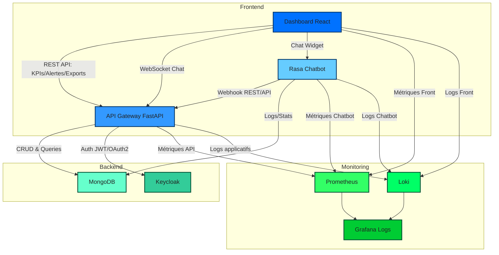

# Interface Utilisateur : Dashboard & Chatbot

## 🌟 Description

Ce module fournit une interface utilisateur complète permettant de visualiser les scores, les alertes, les KPIs, et d’interagir avec un chatbot. L’architecture inclut :

- **Dashboard React** : visualisation des KPIs, alertes, graphiques d’évolution, export PDF/Excel.  
- **Chatbot Rasa** : interaction conversationnelle FR/EN via webhooks.  
- **API Gateway FastAPI** : centralisation des APIs, gestion auth (JWT/OAuth2), WebSocket pour chat en temps réel.  
- **MongoDB** : stockage des données et logs applicatifs.  
- **Keycloak** : gestion des utilisateurs et authentification.  
- **Monitoring** : Prometheus + Grafana pour métriques, Loki pour logs centralisés.  
- **Docker Compose** : orchestration complète des services.

---

## 📊 Diagramme Architecture



---

## ⚙️ Installation & Lancement

1. Cloner le projet :  
```bash
git clone <repo_url>
cd interface_utilisateur
```

2. Construire et lancer les services Docker :  
```bash
docker-compose up --build
```

3. Accéder aux services :  

| Service | Port |
|---------|------|
| Dashboard React | http://localhost:3000 |
| Grafana | http://localhost:3001 |
| Prometheus | http://localhost:9090 |
| API Gateway | http://localhost:8000 |
| Rasa Chatbot | http://localhost:5005 |

---

## 🔑 Fonctionnalités

### Dashboard
- KPIs : taux de fraude, AUC, latence
- Graphiques d’évolution des scores
- Alertes et filtrage
- Export PDF/Excel

### Chatbot
- Interactions FR/EN
- Intégration via iframe ou composant latéral
- Scénarios conversationnels configurables
- Appel APIs pour scores et alertes

### API Gateway
- Routes REST pour dashboard et chatbot
- Authentification JWT/OAuth2
- WebSocket pour chat en temps réel

### Monitoring
- Prometheus : métriques temps de réponse et KPIs
- Grafana : dashboards interactifs
- Loki : centralisation logs applicatifs

---

## 📌 Notes
- Tous les fichiers de configuration (Prometheus, Loki, dashboards Grafana) sont dans `monitoring/`.  
- Les secrets et clés d’API doivent être configurés via variables d’environnement ou `credentials.yml`.  
- Les tests conversationnels chatbot FR/EN sont dans `chatbot/test_intents_*.yml`.
