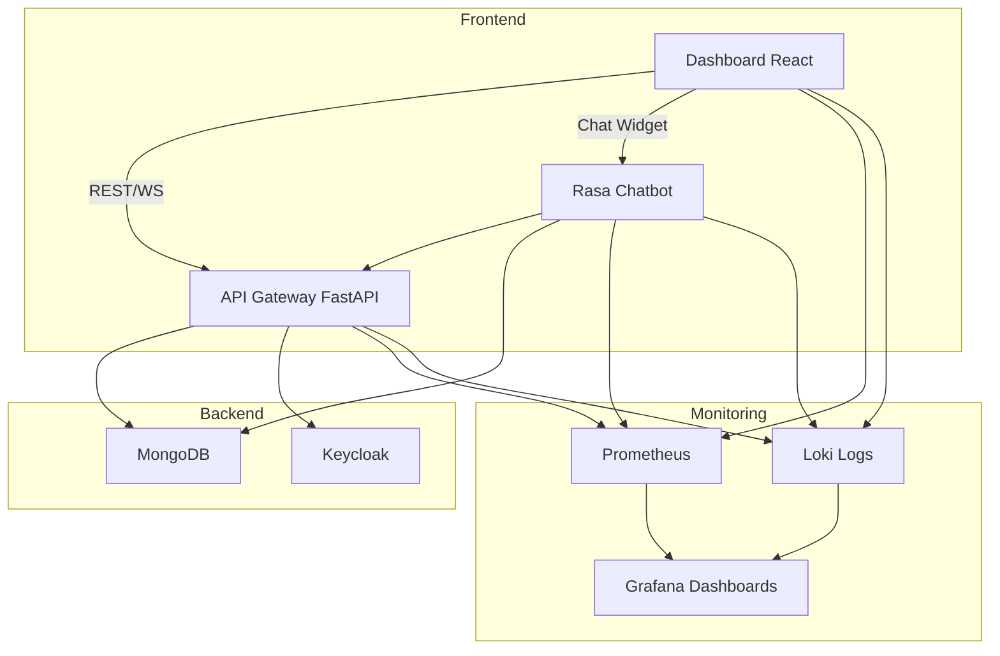
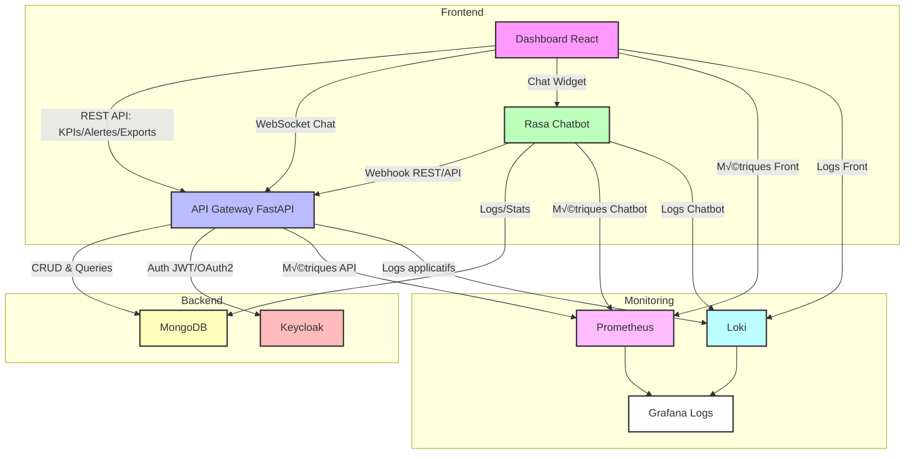

# Interface Utilisateur : Dashboard & Chatbot

## üåü Description

Ce module fournit une interface utilisateur complète permettant de visualiser les scores, les alertes, les KPIs, et d’interagir avec un chatbot. L’architecture inclut :

- **Dashboard React** : visualisation des KPIs, alertes, graphiques d’évolution, export PDF/Excel.  
- **Chatbot Rasa** : interaction conversationnelle FR/EN via webhooks.  
- **API Gateway FastAPI** : centralisation des APIs, gestion auth (JWT/OAuth2), WebSocket pour chat en temps réel.  
- **MongoDB** : stockage des données et logs applicatifs.  
- **Keycloak** : gestion des utilisateurs et authentification.  
- **Monitoring** : Prometheus + Grafana pour métriques, Loki pour logs centralisés.  
- **Docker Compose** : orchestration complète des services.

---

## 📁 Arborescence du projet
## üìä Diagramme Architecture


```mermaid
graph TD
    subgraph Frontend
        A[Dashboard React] -->|REST/WS| B[API Gateway FastAPI]
        A -->|Chat Widget| C[Rasa Chatbot]
    end

    subgraph Backend
        B --> D[MongoDB]
        B --> E[Keycloak]
        C --> B
        C --> D
    end

    subgraph Monitoring
        B --> F[Prometheus]
        A --> F
        C --> F
        B --> G[Loki Logs]
        A --> G
        C --> G
        F --> H[Grafana Dashboards]
        G --> H
    end
```
---

```mermaid
graph TD
    subgraph Frontend
        A[Dashboard React] -->|REST/WS| B[API Gateway FastAPI]
        A -->|Chat Widget| C[Rasa Chatbot]
    end

    subgraph Backend
        B --> D[MongoDB]
        B --> E[Keycloak]
        C --> B
        C --> D
    end

    subgraph Monitoring
        B --> F[Prometheus]
        A --> F
        C --> F
        B --> G[Loki Logs]
        A --> G
        C --> G
        F --> H[Grafana Dashboards]
        G --> H
    end
```
---

```mermaid
graph TD
    %% Frontend
    subgraph Frontend
        A[Dashboard React] -->|REST API: KPIs/Alertes/Exports| B[API Gateway FastAPI]
        A -->|WebSocket Chat| B
        A -->|Chat Widget| C[Rasa Chatbot]
    end

    %% Backend
    subgraph Backend
        B -->|CRUD & Queries| D[MongoDB]
        B -->|Auth JWT/OAuth2| E[Keycloak]
        C -->|Webhook REST/API| B
        C -->|Logs/Stats| D
    end

    %% Monitoring
    subgraph Monitoring
        B -->|Métriques API| F[Prometheus]
        A -->|Métriques Front| F
        C -->|Métriques Chatbot| F
        B -->|Logs applicatifs| G[Loki]
        A -->|Logs Front| G
        C -->|Logs Chatbot| G
        F --> H[Grafana Dashboards KPIs & Latence]
        G --> H[Grafana Logs]
    end

    %% Flows
    style A fill:#f9f,stroke:#333,stroke-width:2px
    style B fill:#bbf,stroke:#333,stroke-width:2px
    style C fill:#bfb,stroke:#333,stroke-width:2px
    style D fill:#ffb,stroke:#333,stroke-width:2px
    style E fill:#fbb,stroke:#333,stroke-width:2px
    style F fill:#fbf,stroke:#333,stroke-width:2px
    style G fill:#bff,stroke:#333,stroke-width:2px
    style H fill:#fff,stroke:#333,stroke-width:2px
```
---
---

## ⚙️ Installation & Lancement

1. Cloner le projet :  
```bash
git clone <repo_url>
cd interface_utilisateur
```

2. Construire et lancer les services Docker :  
```bash
docker-compose up --build
```

3. Accéder aux services :  

| Service | Port |
|---------|------|
| Dashboard React | http://localhost:3000 |
| Grafana | http://localhost:3001 |
| Prometheus | http://localhost:9090 |
| API Gateway | http://localhost:8000 |
| Rasa Chatbot | http://localhost:5005 |

---

## 🔑 Fonctionnalités

### Dashboard
- KPIs : taux de fraude, AUC, latence
- Graphiques d’évolution des scores
- Alertes et filtrage
- Export PDF/Excel

### Chatbot
- Interactions FR/EN
- Intégration via iframe ou composant latéral
- Scénarios conversationnels configurables
- Appel APIs pour scores et alertes

### API Gateway
- Routes REST pour dashboard et chatbot
- Authentification JWT/OAuth2
- WebSocket pour chat en temps réel

### Monitoring
- Prometheus : métriques temps de réponse et KPIs
- Grafana : dashboards interactifs
- Loki : centralisation logs applicatifs

---

## üìå Notes
- Tous les fichiers de configuration (Prometheus, Loki, dashboards Grafana) sont dans `monitoring/`.  
- Les secrets et clés d’API doivent être configurés via variables d’environnement ou `credentials.yml`.  
- Les tests conversationnels chatbot FR/EN sont dans `chatbot/test_intents_*.yml`.